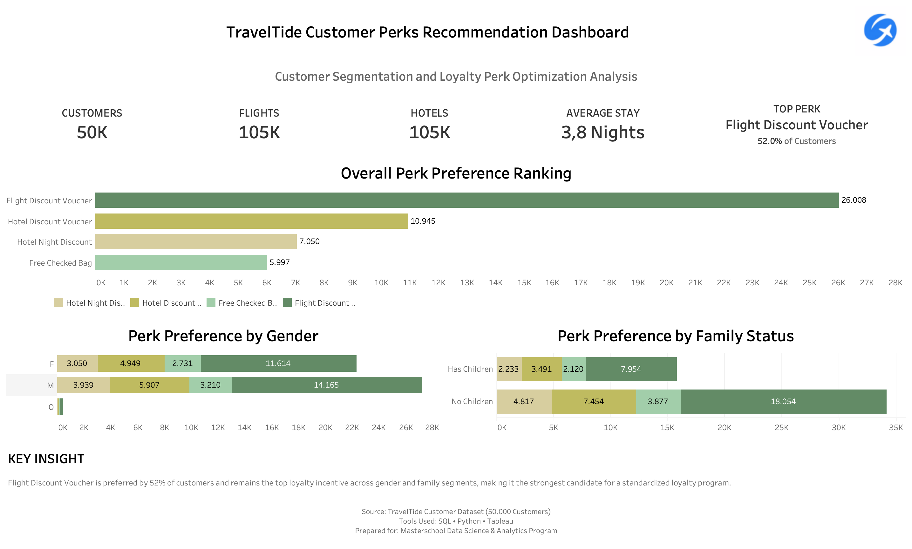
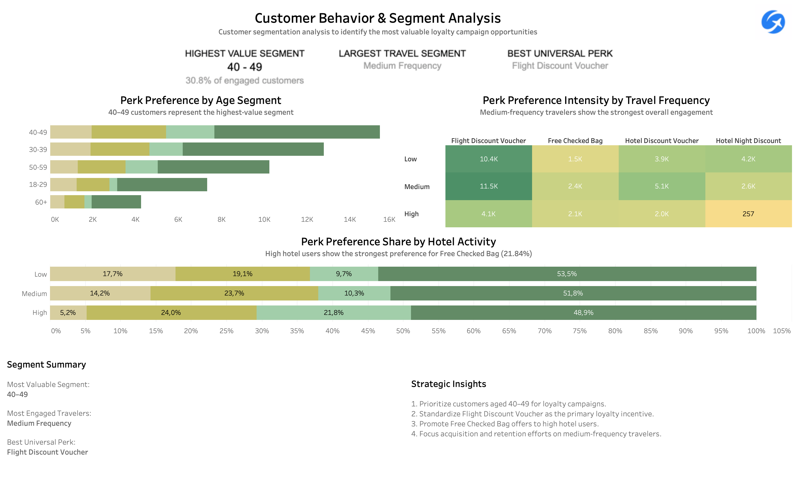
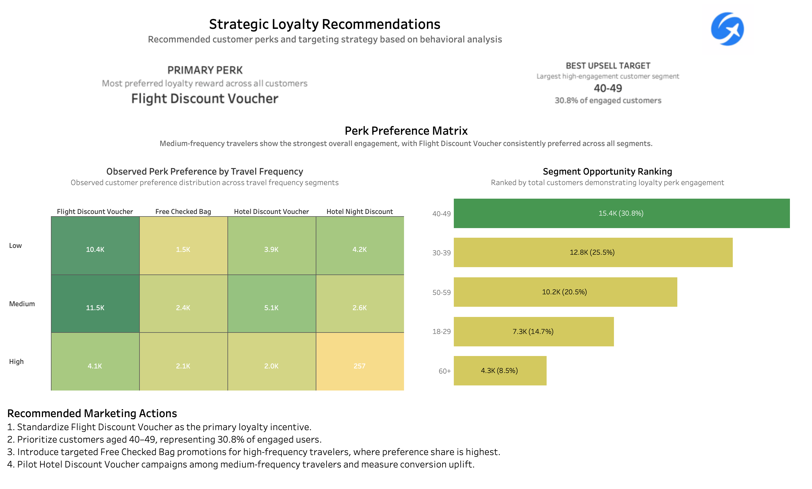

# Tableau Dashboards

This folder contains the final Tableau dashboards developed for the TravelTide Customer Loyalty Perks Analysis project.

## Dashboard 1: Executive Overview

Provides a high-level summary of customer behavior, perk preferences, and overall loyalty program opportunities.

Key findings:

* Flight Discount Voucher is preferred by 52% of customers.
* Consistent preference across gender and family segments.
* Average stay length is 3.8 nights.

---

## Dashboard 2: Customer Segment Insights

Explores customer engagement across demographic and behavioral segments.

Key findings:

* Customers aged 40–49 represent the highest-value segment.
* Medium-frequency travelers form the largest active segment.
* High hotel users demonstrate distinct perk preferences.

---

## Dashboard 3: Strategic Loyalty Recommendations

Converts analytical findings into actionable business recommendations.

Recommendations:

1. Standardize Flight Discount Voucher as the primary loyalty incentive.
2. Prioritize customers aged 40–49 for loyalty campaigns.
3. Target high-frequency travelers with Free Checked Bag promotions.
4. Test Hotel Discount Voucher campaigns among medium-frequency travelers.

## Interactive Dashboard

View the interactive Tableau dashboard here:

[Tableau Public Dashboard](https://public.tableau.com/views/TravelTide-MasteryProject_FINAL1/ExecutiveOverview?:language=en-GB&:sid=&:redirect=auth&:display_count=n&:origin=viz_share_link)
