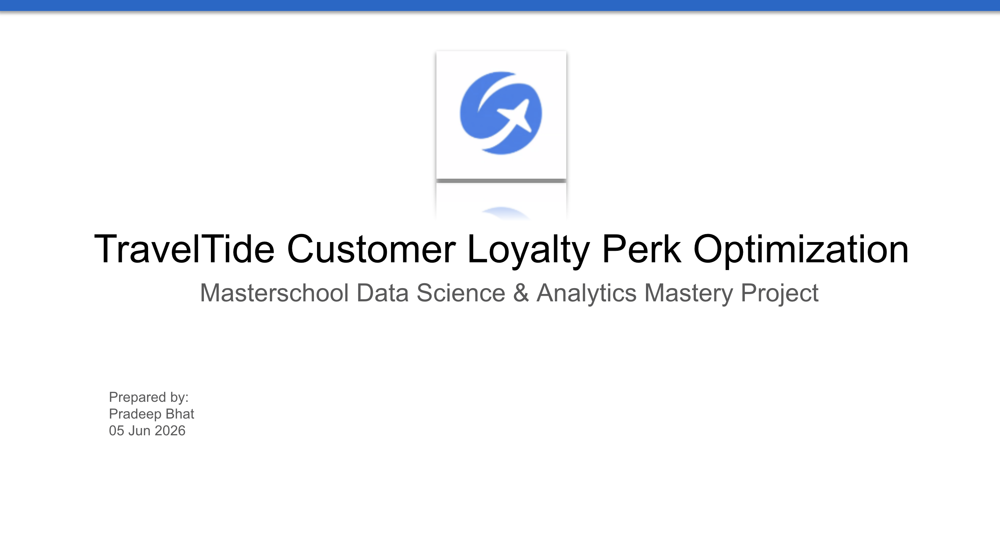

# Executive Presentation

This presentation summarizes an end-to-end customer analytics project for TravelTide, focused on identifying the most effective loyalty perks to improve customer engagement and retention.

Using SQL, Python, and Tableau, customer booking behavior was analyzed, meaningful customer segments were identified, and actionable loyalty program recommendations were developed.

The presentation covers:

- Business problem definition
- Customer behavior analysis
- Segmentation methodology
- Dashboard insights
- Strategic loyalty recommendations
- Future optimization opportunities

## Audience

- Business stakeholders
- Product managers
- Marketing teams
- Executive leadership

## Project Objective

Analyze customer behavior and booking patterns to identify the most effective loyalty perks for TravelTide customers.

The project combines:

* SQL data extraction and transformation
* Python feature engineering and analysis
* Tableau dashboard development
* Customer segmentation
* Loyalty perk recommendation strategy

## Key Findings

- Flight Discount Voucher preferred by 52% of customers
- Customers aged 40–49 represent 30.8% of engaged users
- Medium-frequency travelers represent the largest active segment
- Multi-service customers show the strongest engagement levels
- High hotel users respond strongly to Free Checked Bag incentives

## Business Impact

This project demonstrates how customer analytics can be translated into actionable business decisions by:

- Identifying high-value customer segments
- Prioritizing marketing investment
- Improving loyalty program effectiveness
- Supporting retention-focused decision making
- Establishing a foundation for future machine learning and personalization initiatives

## Files

| File | Description |
|--------|-------------|
| traveltide_customer_loyalty_optimization.pptx | Editable presentation deck |
| traveltide_customer_loyalty_optimization.pdf | Presentation PDF |
| presentation_speaker_notes.md | Speaker notes and Q&A preparation |

## Technology Stack

- SQL (Data Extraction & Transformation)
- Python / Pandas (Feature Engineering & Analysis)
- Tableau (Dashboard Development & Visualization)
- GitHub (Version Control & Documentation)

## Presentation Contents

The presentation covers:

1. Business problem definition
2. Data preparation process
3. Customer behavior insights
4. Segmentation methodology
5. Executive dashboards
6. Strategic recommendations
7. Future optimization opportunities

## Related Project Assets

- `/sql` – Data extraction, profiling, feature engineering, and validation queries
- `/notebooks` – Python analysis and segmentation workflow
- `/dashboard` – Tableau dashboards and business insights
- `/data` – Processed analytical dataset

## Outcome

The analysis identified Flight Discount Voucher as the most effective universal loyalty incentive and highlighted customers aged 40–49 and medium-frequency travelers as the highest-value target segments.

The resulting segmentation framework provides TravelTide with a scalable, data-driven approach for loyalty campaign design, customer retention, and future personalization initiatives.
